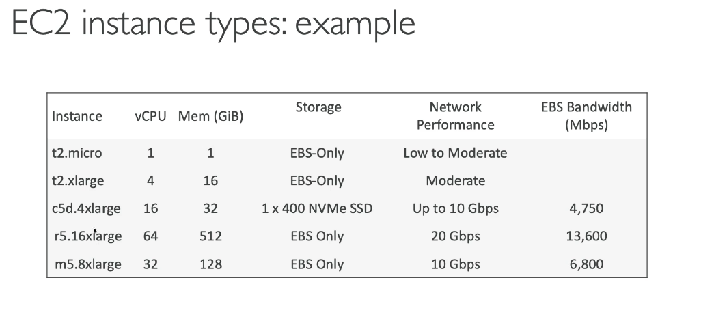

# EC2 Fundamentals

One of most popular AWS offerings
Elastic Compute Cloud - Infrastructure as a Service

- Can rent virtual machines - EC2 instances
- Store data on virtual drives - EBS
- Distributing load across machines - ELB
- Auto Scaling Groups - ASG

Options for picking / configuring EC2 instance

OS
- Linux
- windows
- Mac OS

- how much CPU - compute power
- how much RAM - memory
- how much storage
  - network attached EBS or EFS
  - hardware attached - EC2 instance store
- What kind of network card
- Firewall rules
  - security group
- Bootstrap script
  - used to configure machine at first launch
  - EC2 User Data
  - used to automate boot tasks
    - install updates
    - install software
    - download common files from internet
    - start server 
    - runs with the root user (sudo)

EC2 Instance type

t2.micro is part of the AWS free tier

